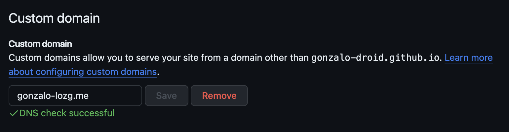
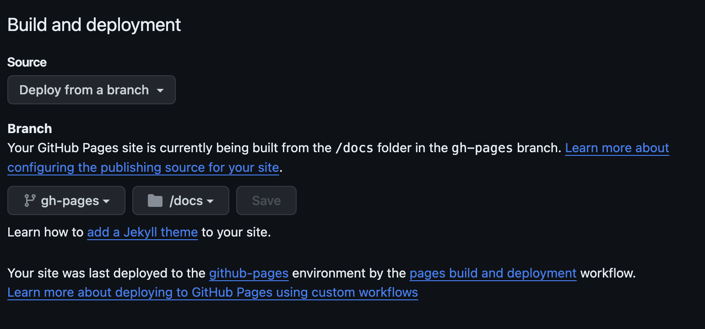

<!-- Img obtenida: https://simpleicons.org/?q=Postman -->
<!-- Referencia : https://dev.to/gedgonz/haciendo-deploy-de-una-app-en-angular-a-githubpages-4bll -->
<!-- https://medium.com/notasdeangular/despliegue-de-tu-aplicaci%C3%B3n-en-angular-usando-github-actions-c0b5bc67ddb0 -->


## Deploy GitHub Pages


#### Paso 1
-   Vas a necesitar crear un repositorio en tu github

#### Paso 2
- Vas a necesitar un proyecto angular, ejecuta el siguiente comando para crear tu proyecto

```
ng new app-name
```
#### Paso 3
- Instale Angular CLI gh-pages (https://www.npmjs.com/package/angular-cli-ghpages)

```
npm i angular-cli-ghpages
ng add angular-cli-ghpages
```

#### Paso 4
- Implementar en gh-pages

```
ng deploy --base-href=/gonzalo-droid.github.io/
```


#### Paso 5
- Github pages

- Custom Domain (https://github.com/gonzalo-droid/gonzalo-droid.github.io/settings/pages)



-   Branch

